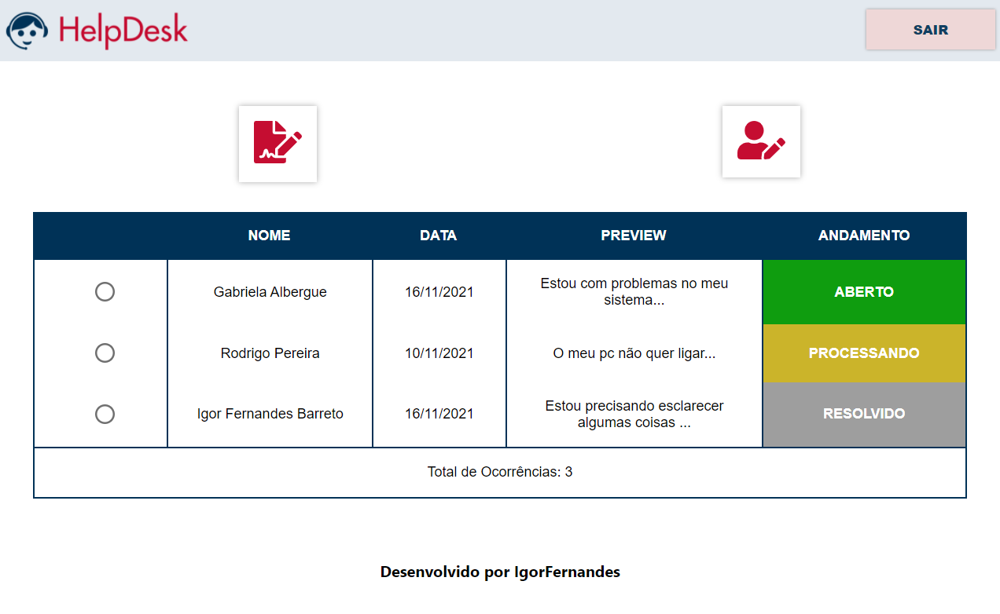

# HelpDesk - Gerenciador de Ocorrências
# Desenvolvedor: Igor Fernandes

<pre>
- A produção de um gerenciador de tarefas utilizando apenas sessões do servidor para armazenar os dados inseridos no projeto. 
</pre>

## Apresentação:

## 🔗 Grade de conteúdos:

- [Recursos](#recursos)
- [Arquitetura](#arquitetura)
- [Instruções](#instruções)

============================//================//===========

## ⚡ RECURSOS:

### [RECURSOS] - FrontEnd
- [CSS]
= [JS]

### [RECURSOS] - BackEnd
- [PHP]

## 📂 ARQUITETURA

###  [ARQUITETURA] - Bit/Git

<table>
    <thead>
        <tr>
            <td>
                public
            </td>
            <td>
                services
            </td>
            <td>
                settings
            </td>
        <tr>
    </thead>
    <tbody>
        <tr>
            <td> css | img | js</td>
            <td> login | register</td>
            <td> restrict | vars</td>
        </tr>
    </tbody>
</table>

###  [ARQUITETURA] - Visual

| public         |   services       |   settings                    
| css - js - img | login - register |  restrict - vars
 

## 📂 INSTRUÇÕES

### [INSTRUÇÕES] - Instalação 
<pre>
-  Utilize PHP versão >=7.2.0
</pre>

### [INSTRUÇÕES] - CRIANDO ARQUIVOS - CSS (Bit/Git)

<table>
    <thead>
        <tr>
            <td>Dispositivos</td>
            <td>Largura</td>
        <tr>
    </thead>
    <tbody>
        <tr>
            <td> Extra Extra largo (desktop) </td>
            <td> 1440px </td>
        </tr>
        <tr>
            <td> Extra largo (laptop) </td>
            <td> 1240px </td>
        </tr>
        <tr>
            <td> Largo (laptop && tablet) </td>
            <td> 1020px </td>
        </tr>
        <tr>
            <td> Medio (table && mobile) </td>
            <td> 800px </td>
        </tr>
        <tr>
            <td> Pequeno (mobile) </td>
            <td> 500px </td>
        </tr>
           <tr>
            <td> Extra pequeno (mobile) </td>
            <td> 370px </td>
        </tr>
    </tbody>
</table>

### [INSTRUÇÕES] - CRIANDO ARQUIVOS - CSS
<pre>
- Introduza os códigos no arquivos ".js";
</pre>

